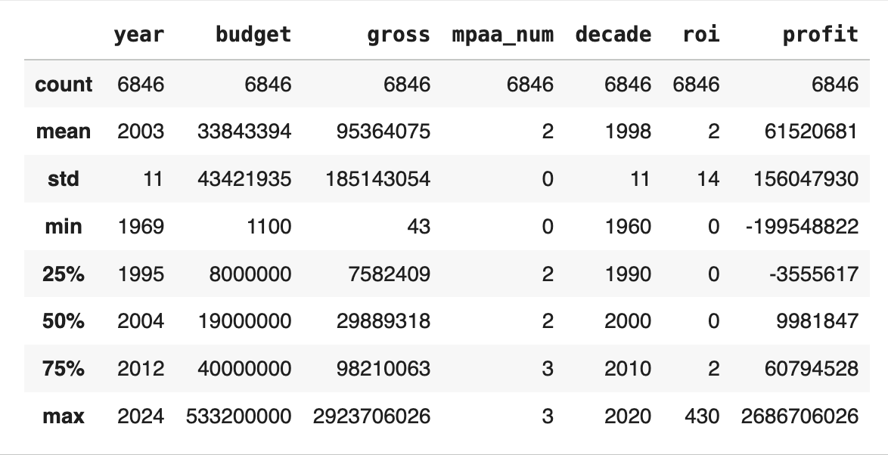
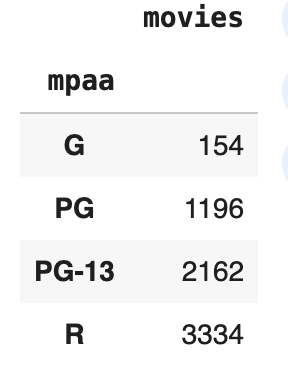
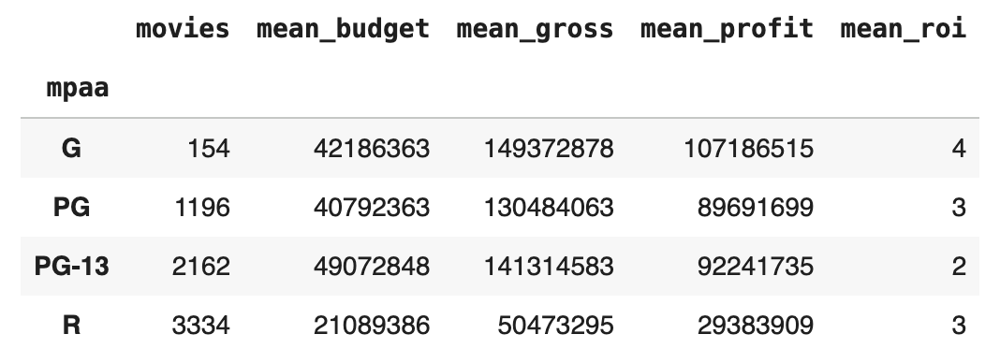
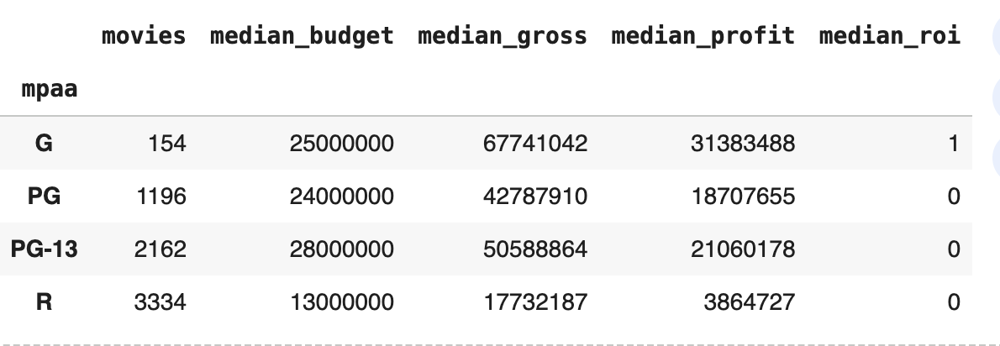
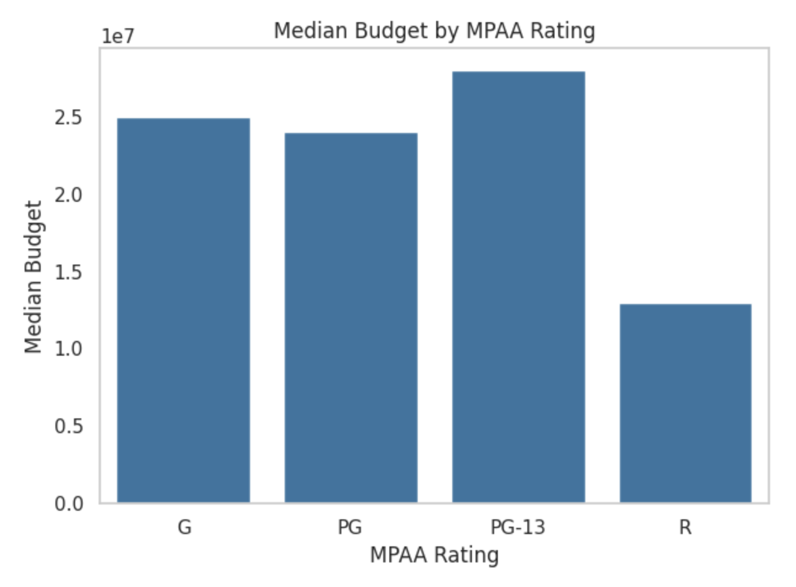

# MPAA Ratings and Profitability - Exploratory Data Analysis

## Introduction

I have noticed over the years that many of the biggest blockbusters have been movies we could all enjoy going to see together as a family. Yet recently, it seems that there are fewer movies I feel I can comfortably take my younger children to.

This made me curious to explore what the drivers or motivations are for creating rated "R" movies vs lower rated movies.

This exploratory data analysis (EDA) investigates how movie content ratings (G, PG, PG-13, R) relate to earnings and profits.

The core questions are simple and practical:
* Which ratings are produced most often?
* Which MPAA ratings tend to earn more revenue?
* Which cost more to make?
* Which deliver higher profitability?
* Do “family-friendly” films (G/PG, or even PG-13) outperform R-rated films?
* How are these trends changing over time?

### Dataset Selection

The hardest thing to find was a good movies dataset that also included MPAA rating data. I ultimately combined two widely used movie datasets found on Kaggle.com:
* [Top Movies Ultimate Dataset](https://www.kaggle.com/datasets/michaelmatta0/movies-ultimate-metrics-features-and-metadata?select=Top+Movies+%28Raw+Data%29.csv )
* [Movies Dataset](https://www.kaggle.com/datasets/ashishkumarjayswal/movies-updated-data)

Both included title, year, MPAA rating, genre, production budget and worldwide gross. 

### Inspecting the Data

The first dataset contained a set of 5744 movies, with little missing data, however I wanted to make sure that it represented trends over the past 40 years, so I wanted to check and be sure the range of years it covered.

To supplement my data, I found another dataset of similar size and quality, but that appeared to have more movies from the 80s and 90s to round out my dataset.

My 2nd dataset looked great, but had over 1200 values equal to zero in the budget column. My datasets overlapped a little bit, so I was hoping that in merging the two, I could fill in some of the missing data.

### Merging the dataframes
I performed a full outer merge of `df` and `df2` based on 'title' and 'year'. This included all rows from both dataframes, creating a combined dataframe.

### Cleaning my merged dataframe

To clean my merged dataframe, I:
- looked at each column and checked for null values and zero values
- checked data types
- standardized field values
- tried to populate missing values or values == 0
- dropped data that I didn't need.
- created several new columns to make it easier to analyze my data.

### Descriptive Statistics By MPAA Rating
With a solid dataset in place, I wanted to explore the different relationships between cost, revenue, profit, and ROI -- and see how they differ by MPAA rating.

#### Counts
First I wanted to get an idea of how many of each type of movie (by MPAA rating) there was to answer the question "Which ratings are produced most often?".

Looking at this data, we can see that far more R movies have been made than other types. **R movies represent over 20 times the number of G movies, and almost 3 times the number of PG movies.**

#### Mean Values
Next I looked at things by the averages. The table below provides a summary of key statistics for each MPAA rating group.

#### Median Values
I noticed there are quite a few outliers in my dataset. To get a better measure of central tendency, next I looked at things by the **median values**. The table below provides a summary of key statistics for each MPAA rating group.

### Key Insights
I discovered a number of key insights:

#### **Median Cost (Budget) By MPAA Rating**
Which type of movie is the cheapest or most expensive to make? Looking through the median lens, **R movies cost about half as much to make as PG, G, and PG-13 movies.** PG-13 movies budgets are slightly more than G or PG movies.

#### **Median Earnings (Gross) By MPAA Rating**
Which type of movie generates the most income? Median rated G movies bring in by far the most money, followed by PG-13, and PG. R movies make the least money by a significant margin. **Median G movies make nearly 3.8 times more than R movies.**

#### **Median Profit By MPAA Rating**
Which type of movie is most profitable to produce? Rated G movies are by far the most profitable. **G movies are over 8 times more profitable than R movies, and over 1.5 times more profitable than PG or PG-13 movies.**

#### **Median ROI by MPAA Rating**
When looking at the mean ROI, 'G' and 'R' ratings appear to have higher averages. However, the **median** ROI tells a different story, with 'G', 'PG', and 'PG-13' having higher median ROIs than 'R'. This difference between mean and median ROI, especially for 'R' rated movies, suggests that while the average ROI for R-rated films is boosted by a few highly profitable outliers (low budget, high gross), the typical R-rated film has a lower ROI compared to the typical G, PG, or PG-13 film.

More interestingly, it appears that **the more family friendly the movie is, the higher the ROI.**

#### Outliers
When dealing with movies, there are huge ranges in budgets and gross earnings, and there are alot of outliers.

I used a boxplot to look at the distribution of budgets by rating, and then individual scatterplots to look at outliers in each area to gauge if it is likely that my conclusions would substantially flip by omitting outliers.

I decided not to bother removing outliers, because it is interesting to look at the individual cases, and although they do skew the averages, the don't impact the medians.

## Correlations ##

The correlation between **budget and gross** is the strongest among the relationships between the financial metrics. The correlations between year/decade and budget/gross are also notable and point to trends over time. 

#### Scatter plot of Budget vs Gross
To better see this correlation, I made a scatterplot that visualizes the relationship between the budget of a movie and its gross revenue, showing the strong correlation between the budget of a movie and how much it makes. 

key insights

visualizations