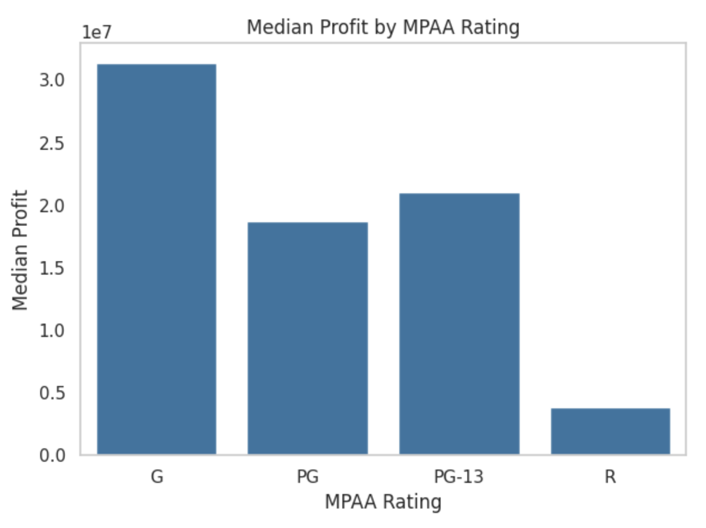
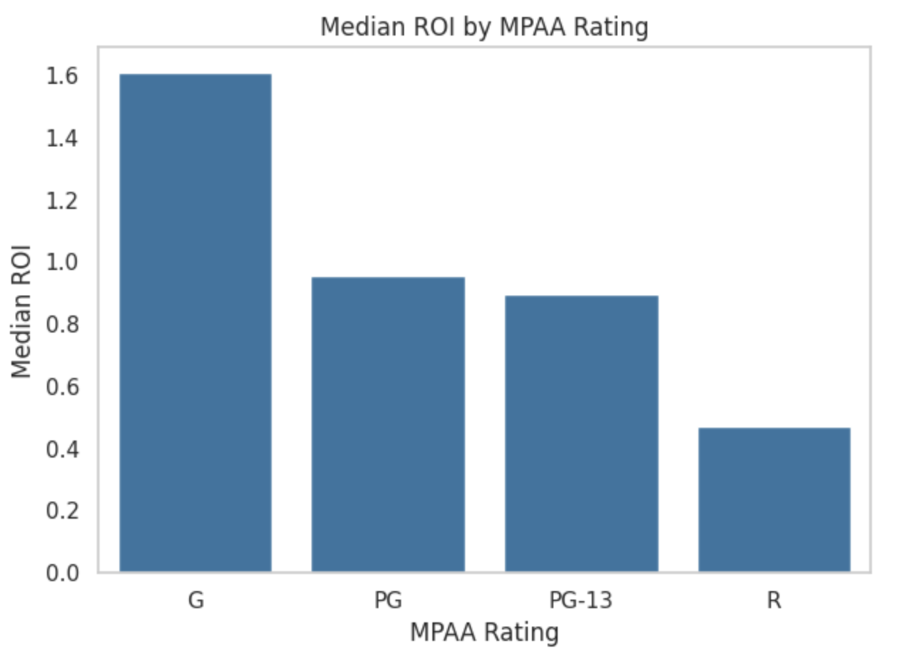
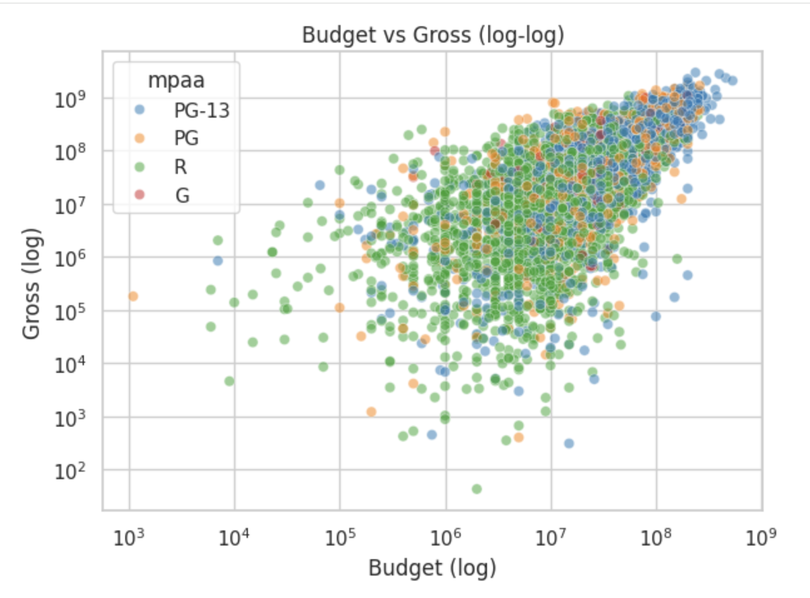
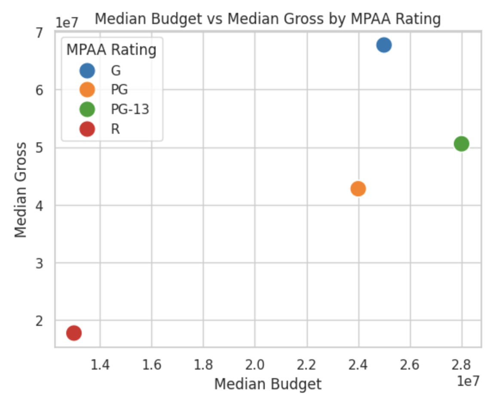

# MPAA Ratings and Profitability - Exploratory Data Analysis

## Introduction

I have noticed over the years that many of the biggest blockbusters have been movies we could all enjoy going to see together as a family. Yet recently, it seems that there are fewer movies I feel I can comfortably take my younger children to.

This made me curious to explore what the drivers or motivations are for creating rated "R" movies vs lower rated movies.

This exploratory data analysis (EDA) investigates how movie content ratings (G, PG, PG-13, R) relate to earnings and profits.

The core questions are simple and practical:
* Which ratings are produced most often?
* Which MPAA ratings tend to earn more revenue?
* Which cost more to make?
* Which deliver higher profitability?
* Do “family-friendly” films (G/PG, or even PG-13) outperform R-rated films?
* How are these trends changing over time?

### Dataset Selection

The hardest thing to find was a good movies dataset that also included MPAA rating data. I ultimately combined two widely used movie datasets found on Kaggle.com:
* [Top Movies Ultimate Dataset](https://www.kaggle.com/datasets/michaelmatta0/movies-ultimate-metrics-features-and-metadata?select=Top+Movies+%28Raw+Data%29.csv )
* [Movies Dataset](https://www.kaggle.com/datasets/ashishkumarjayswal/movies-updated-data)

Both included title, year, MPAA rating, genre, production budget and worldwide gross. 

### Inspecting the Data

The first dataset contained a set of 5744 movies, with little missing data, however I wanted to make sure that it represented trends over the past 40 years, so I wanted to check and be sure the range of years it covered.

To supplement my data, I found another dataset of similar size and quality, but that appeared to have more movies from the 80s and 90s to round out my dataset.

My 2nd dataset looked great, but had over 1200 values equal to zero in the budget column. My datasets overlapped a little bit, so I was hoping that in merging the two, I could fill in some of the missing data.

### Merging the dataframes
I performed a full outer merge of `df` and `df2` based on 'title' and 'year'. This included all rows from both dataframes, creating a combined dataframe.

### Cleaning my merged dataframe

To clean my merged dataframe, I:
- looked at each column and checked for null values and zero values
- checked data types
- standardized field values
- tried to populate missing values or values == 0
- dropped data that I didn't need.
- created several new columns to make it easier to analyze my data.

### Descriptive Statistics By MPAA Rating
With a solid dataset in place, I wanted to explore the different relationships between cost, revenue, profit, and ROI -- and see how they differ by MPAA rating.

#### Counts
First I wanted to get an idea of how many of each type of movie (by MPAA rating) there was to answer the question "Which ratings are produced most often?".

Looking at this data, we can see that far more R movies have been made than other types. **R movies represent over 20 times the number of G movies, and almost 3 times the number of PG movies.**

#### Mean Values
Next I looked at things by the averages. The table below provides a summary of key statistics for each MPAA rating group.

#### Median Values
I noticed there are quite a few outliers in my dataset. To get a better measure of central tendency, next I looked at things by the **median values**. The table below provides a summary of key statistics for each MPAA rating group.

### Key Insights
I discovered a number of key insights:

#### **Median Cost (Budget) By MPAA Rating**
Which type of movie is the cheapest or most expensive to make? Looking through the median lens, **R movies cost about half as much to make as PG, G, and PG-13 movies.** PG-13 movies budgets are slightly more than G or PG movies.

#### **Median Earnings (Gross) By MPAA Rating**
Which type of movie generates the most income? Median rated G movies bring in by far the most money, followed by PG-13, and PG. R movies make the least money by a significant margin. **Median G movies make nearly 3.8 times more than R movies.**

#### **Median Profit By MPAA Rating**
Which type of movie is most profitable to produce? Rated G movies are by far the most profitable. **G movies are over 8 times more profitable than R movies, and over 1.5 times more profitable than PG or PG-13 movies.**

#### **Median ROI by MPAA Rating**
When looking at the mean ROI, 'G' and 'R' ratings appear to have higher averages. However, the **median** ROI tells a different story, with 'G', 'PG', and 'PG-13' having higher median ROIs than 'R'. This difference between mean and median ROI, especially for 'R' rated movies, suggests that while the average ROI for R-rated films is boosted by a few highly profitable outliers (low budget, high gross), the typical R-rated film has a lower ROI compared to the typical G, PG, or PG-13 film.

More interestingly, it appears that **the more family friendly the movie is, the higher the ROI.**

#### Outliers
When dealing with movies, there are huge ranges in budgets and gross earnings, and there are alot of outliers.

I used a boxplot to look at the distribution of budgets by rating, and then individual scatterplots to look at outliers in each area to gauge if it is likely that my conclusions would substantially flip by omitting outliers.

I decided not to bother removing outliers, because it is interesting to look at the individual cases, and although they do skew the averages, the don't impact the medians.

## Correlations ##

The correlation between **budget and gross** is the strongest among the relationships between the financial metrics. The correlations between year/decade and budget/gross are also notable and point to trends over time. 

#### Scatter plot of Budget vs Gross
To better see this correlation, I made a scatterplot that visualizes the relationship between the budget of a movie and its gross revenue, showing the strong correlation between the budget of a movie and how much it makes. 

This scatter plot visually makes it easiest to visualize the relationships between budget, gross and MPAA rating: 
- G movies are the highest grossing, but very expensive to make
- PG movies are not the most expensive to make, but also not as high grossing.- - PG-13 movies are more expensive to make but slightly higher grossing than PG movies.
- R-rated movies are by far the least expensive to make and also by far the lowest grossing.

## Trends over Time
One of my initial question in this study was whether any observed trends were changing over time. With over 40 years of data to look at, we should be able to see major changes when aggregating by decade.

#### Count by Rating per Decade
I created a line plot to visualize the number of movies per decade of each MPAA Rating. This reveals some interesting trends in movie production over time:

- **Dominance of R-rated movies:** The plot clearly shows that R-rated movies have consistently had the highest number of releases across most decades, especially from the 1980s onwards.
- **Growth of PG-13:** PG-13 was created in the 1980s to fill the gap between PG and R, and it has grown steadily to surpass PG releases. 
- **Decline of G movies**: The number of PG and G releases shows more fluctuation across the decades compared to R and PG-13. Interestingly, G-rated movies consistently have the lowest number of releases and have decreased slightly in recent decades, in spite of their success.

#### Budget by Rating per Decade
Looking at the difference in production costs over time we see some interesting trends:

Flattened median Budget for G Movies from the 1990s on: 
- There is a flattening, even a decline, of budget in G movies from the 1990s forward, which doesn't seem to align with the average budget, count, or profit charts. Why is this?
- The flattening median could suggest that the majority of G-rated films produced since the 1990s, while still profitable on average, might not have had the same consistently increasing budgets as the most expensive G-rated films. This could include a steady stream of lower-to-mid budget G-rated films (e.g., certain documentaries, independent family films, or direct-to-video releases not fully captured in the data).
- In some cases, advancements in technology might allow for high-quality G-rated films to be produced at relatively lower costs compared to earlier decades, potentially contributing to a stable or slightly declining median budget even as production values remain high.

NOTE: There is only a single G movie in our dataset for the 2020s, so the sample size is too small to infer anything from.

#### Gross Revenue by Rating (by Decade)

Looking at how typical gross revenue for movies of different ratings has changed over time, there are some interesting insights:

- **Movies are Big Business:** Generally, the median gross revenue for all MPAA ratings appears to have an upward trend across the decades, indicating that movies, in general, are earning more over time (though this is not adjusted for inflation). G, PG, and PG-13 rated movies tend to have higher typical earnings per film compared to R-rated movies, and this trend appears to persist across most decades in the dataset.
- **Dip in G Movies Revenue in the 2010s:** The dip in G movie revenue in the 2010s is also notable. This could be due to fewer G-rated releases. With fewer G movies being made, the sample size for calculating the median revenue is smaller and could be more influenced by the performance of a few films.
- **Shift to PG?:** Some films that might have been rated G in earlier decades could now be receiving a PG rating due to changing content standards or a desire to reach a slightly older family audience. The increasing median revenue for PG movies in later decades could be driven by the success of major animated films and family-friendly blockbusters. Many highly profitable franchises and standalone movies aimed at a broader audience fall under the PG rating. As production values and marketing for these films have increased over time, so has their earning potential.
- **Rise of the Sequel?**: It's possible that the G-rated films released in the 2010s, as a group, did not perform as well financially as those in surrounding decades, even without being low-budget films.
- **R-rated Movies increase in Popularity:** Consistently across all decades, R-rated movies have the lowest median gross revenue compared to the other ratings, but their median gross has increased over time.

## Summary of Findings

Based on this analysis, here is a summary of the findings, and the answers I found to my initial questions.

**Which ratings are produced most often?**

*   The analysis of movie counts by MPAA rating clearly shows that **R-rated movies are produced most often** in this dataset, followed by PG-13, PG, and then G. This trend is consistent across most decades from the 1980s onwards, with R and PG-13 dominating the number of releases.

**Which MPAA ratings tend to earn more revenue?**

*   When looking at average gross revenue, **G-rated movies tend to earn the most**, followed by PG-13 and PG, with **R-rated movies earning the least** on average. The median gross revenue provides a more typical picture, where G-rated movies still lead, followed by PG-13 and PG, with R-rated movies earning significantly less. This suggests that while there are fewer G-rated movies, the typical G movie earns more than a typical movie of other ratings, and the average for G is heavily influenced by a few very high-grossing films.

**Which cost more to make?**

*   Analyzing both average and median budgets, **PG-13 movies tend to have the highest budgets**, followed closely by G and PG. **R-rated movies consistently have the lowest average and median budgets**, costing significantly less to make than movies in the other rating categories.

**Which deliver higher profitability?**

*   Similar to gross revenue, **average profit is highest for G-rated movies**, followed by PG-13 and PG, and lowest for R-rated movies. Median profit shows a more extreme difference, with **G, PG, and PG-13 movies having considerably higher median profits than R-rated movies**. This distinction highlights the impact of high-profit outliers (likely blockbusters) in the G, PG, and PG-13 categories that skew the average upwards. The median suggests that a typical G, PG, or PG-13 movie is more profitable than a typical R-rated movie.

**Do “family-friendly” films (G/PG, or even PG-13) outperform R-rated films?**

*   Based on the analysis of median gross revenue, median profit, and median ROI, **"family-friendly" films (G, PG, and PG-13) generally outperform R-rated films** in terms of typical earnings, profitability, and return on investment. While R-rated films are produced more often and have lower production costs, the data suggests that the typical G, PG, and PG-13 film generates higher revenue and profit, and provides a better return on the investment. The presence of high-ROI outliers in the R category (often low-budget horror films that are very profitable relative to their cost) can inflate the average ROI, but the median ROI provides a clearer picture of the typical return, where family-friendly films tend to fare better.

**How are these trends changing over time?**

*   **Movie Production:** The number of R and PG-13 rated movies has increased significantly over the decades, dominating releases from the 1980s onwards. The number of G and PG releases has been lower and more variable.
*   **Budgets:** Average and median movie budgets have generally increased over time across all ratings, likely due to inflation and increasing production scale. R-rated movies have consistently maintained the lowest average and median budgets per decade.
*   **Revenue and Profit:** Average and median gross revenue and profit have also generally increased over time for all ratings. G, PG, and PG-13 movies have consistently shown higher typical (median) revenue and profit compared to R-rated movies throughout the decades. The average revenue and profit, particularly for G, PG, and PG-13, are heavily influenced by high-grossing and high-profit outlier films in certain decades.

